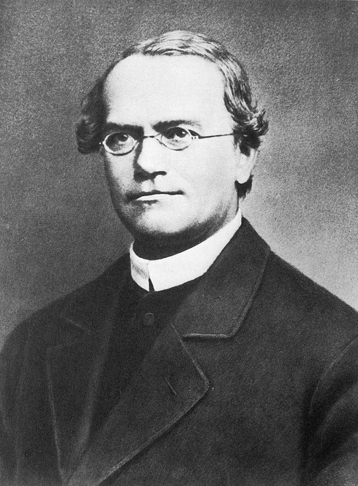
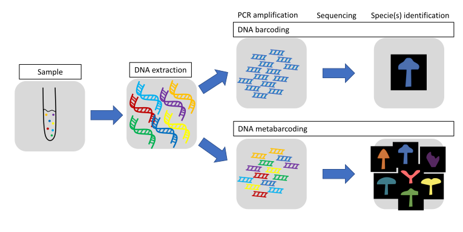
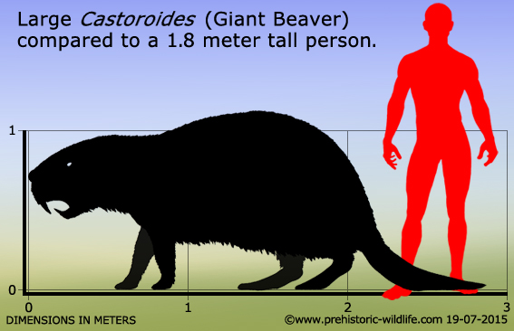
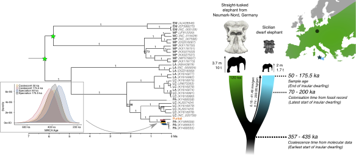

```{r setup, include = FALSE}
library(tidyverse)
library(gganimate)
library(RColorBrewer)
library(knitr)
library(ape)
```

<!-- adding bold and italic options -->
<style>
em {
  font-style: italic
}
strong {
  font-weight: bold;
}
</style>

## Phylogenetics and population genetics lectures

- **Key concepts and Single locus phylogenetics**
  - Theory
  - Methods
  - Discoveries
- Multi-locus phylogenetics
- Population structure
- Conservation genetics

--- 

## MEEB

**Molecular Ecology and Evolution at Bangor**

```{r, out.width = "100%", dpi = 300, echo = FALSE, fig.align='center', fig.cap=""}

```

- 3rd year module "Molecular ecology and evolution"
- Dissertation and MSc projects

--- &twocol

## The link between evolution and genetics

*** =left

```{r, out.width = "80%", dpi = 300, echo = FALSE, fig.align='center', fig.cap=""}
include_graphics("./assets/img/Charles_Darwin_by_Julia_Margaret_Cameron_2.jpg")
```

*** =right

```{r, out.width = "75%", dpi = 300, echo = FALSE, fig.align='centre', fig.cap=""}

```

---

<q>Nothing in biology makes sense, except in the light of evolution</q> (Dobzhansky 1973)

<q>Nothing in evolution makes sense, except in the light of population genetics</q> (Lynch 2007)

--- .segue .dark 

## Key concepts

---

## Your genome

- Size in base-pairs?
- Size in cm?
- Mass in picograms?
- Number autosomes?
- Number of sex chromosomes?
- Number of genes?
- % that is protein coding?
- % that is functional?

---

## Your genome

```{r, out.width = "90%", dpi = 300, echo = FALSE, fig.align='centre', fig.cap=""}
include_graphics("./assets/img/human_genome_dip.svg")
```

--- &twocol

## Genetic locus (plural loci)

*** =left

- Working definition: "a single position on a chromosome"
- Different variants at a locus are called **alleles**
- Difficult to determine in practise
- Simplistically a single nucleotide
- Extending beyond that depends on recombination
- Recombination results in independent evolutionary histories for unlinked loci

*** =right

```{r, out.width = "90%", dpi = 300, echo = FALSE, fig.align='center', fig.cap=""}
include_graphics("./assets/img/recom.svg")
```

--- &twocol

## Examples

*** =left

- Single copy genes/exons (at least practically)
- SNPs
- Microsatellites
- Mitochondrial DNA is a single locus
- Y chromosome (more or less) a single locus

*** =right

```{r, out.width = "100%", dpi = 300, echo = FALSE, fig.align='center', fig.cap=""}
include_graphics("./assets/img/1280px-Mitochondrial_DNA_en.svg.png")
```

--- &thirds

## Neutral evolution

*** =left

- Often people think about evolution in terms of natural selection
- What if there is no selection?
- Motoo Kimura: Neutral theory of molecular evolution, 1968
- Loci evolve by genetic drift
- Drift is determined by the population (size and gene flow)
- Basis of population genetics and phylogenetics
- "Null hypothesis" of molecular evolution

*** =right

```{r, out.width = "90%", dpi = 300, echo = FALSE, fig.align='center', fig.cap=""}
include_graphics("./assets/img/Motoo_Kimura.jpg")
```

---

## Genetic drift

```{r, out.width = "100%", out.height=500, dpi = 300, echo = FALSE, fig.cap=""}
  include_graphics("./assets/img/Practical2_handout_2023.pdf")
```

---

## Simulator

<iframe src = 'https://www.whfreeman.com/BrainHoney/Resource/6716/SitebuilderUploads/Hillis2e/Student%20Resources/Animated%20Tutorials/pol2e_at_1502_genetic_drift_simulation/pol2e_at_1502_genetic_drift_simulation.html' height='600px'></iframe>

--- .segue .dark 

## Single locus phylogenetics - theory

---

## Molecular dating of sabretooth cats

```{r, out.width = "85%", dpi = 300, echo = FALSE, fig.align='center', fig.cap=""}
include_graphics("./assets/img/sabre_tree.svg")
```

---

## Single locus tree (AKA gene tree)

- Evolutionary history of a genetic locus, represented as a tree
- (not always an actual gene)
- Can be used to infer species or population histories*
- Any recombining genome has multiple loci, each with its own gene tree
- Easy to calculate using genetic data (often sequences)

---

## Example: mitochondrial tree

```{r, out.width = "80%", dpi = 300, echo = FALSE, fig.align = "center", fig.cap=""}
  include_graphics("./assets/img/mtDNA_tree.svg")
```

---

## Gene tree terminology

```{r, out.width = "90%", dpi = 300, echo = FALSE, fig.align = "center", fig.cap=""}
  include_graphics("./assets/img/term.png")
```

--- &twocol

## Clades

*** =left

```{r, out.width = "50%", dpi = 300, echo = FALSE, fig.align = "center", fig.cap=""}
  include_graphics("./assets/img/clade_eg.svg")
```

*** =right

- A clade contains one ancestor and all its descendents
- It is a monophyletic group
- Modern taxonomy (generally) tries to align with clades

---

## How does the tree form: lineage sorting

```{r, out.width = "100%", dpi = 300, echo = FALSE, fig.align = "center", fig.cap=""}
  include_graphics("./assets/img/linsort1.svg")
```

---

## How does the tree form: lineage sorting

```{r, out.width = "100%", dpi = 300, echo = FALSE, fig.align = "center", fig.cap=""}
  include_graphics("./assets/img/linsort2.svg")
```

---

## How does the tree form: lineage sorting

```{r, out.width = "100%", dpi = 300, echo = FALSE, fig.align = "center", fig.cap=""}
  include_graphics("./assets/img/linsort3.svg")
```

---

## How does the tree form: lineage sorting

```{r, out.width = "100%", dpi = 300, echo = FALSE, fig.align = "center", fig.cap=""}
  include_graphics("./assets/img/linsort4.svg")
```

---

## How does the tree form: lineage sorting

```{r, out.width = "100%", dpi = 300, echo = FALSE, fig.align = "center", fig.cap=""}
  include_graphics("./assets/img/linsort5.svg")
```

---

## Lineage sorting summary

- Drift sorts the lineages into clades
- This takes time, we can't detect the divergence immediately
- We go through stages of complete/incomplete monophyly
- incomplete to complete lineage sorting
- lineage sorting is faster when the population size is small (= more drift)
- Mutation builds upon the clades, monophyly is retained [unless there is gene flow]
- ILS can be a real problem for inferring relationships, especially in large populaitons with recent divergence events

--- .segue .dark 

## Single locus phylogenetics - methods

--- &twocol

## PCR and Sanger sequencing

*** =left

```{r, out.width = "100%", dpi = 300, echo = FALSE, fig.align = "center", fig.cap=""}
  include_graphics("./assets/img/abi_3130.svg")
```

*** =right

- 700-1000 bp reads
- High accuracy
- 384 samples
- 1 day
- Dominated for 3 decades

---

## PCR and Sanger sequencing

```{r, out.width = "100%", out.height=500, dpi = 300, echo = FALSE, fig.cap=""}
  include_graphics("./assets/img/Practical2_handout_2023.pdf")
```

---

## Next generation sequencing

```{r, out.width = "95%", dpi = 300, echo = FALSE, fig.align='center', fig.cap=""}
include_graphics("./assets/img/aDNA_seq.svg")
```

---

## NGS: ancient DNA

- Fragmented ancient DNA is challenging for PCR
- NGS allows whole DNA molecules to be sequenced
- High levels of contamination
- Hybridisation capture often used
- Especially for complete mitochondrial genome sequences

```{r, out.width = "70%", dpi = 300, echo = FALSE, fig.align='center', fig.cap=""}
include_graphics("./assets/img/hybr.svg")
```

---

## NGS: metabarcoding

```{r, out.width = "100%", dpi = 300, echo = FALSE, fig.align='center', fig.cap=""}

```

--- .segue .dark 

## Single locus phylogenetics - discoveries

--- &twocol

## Macrauchenia

*** =left

- Native South American mammal, in order Liptoterna
- Appeared 7 Ma
- Last species, *M. patachonica*, extinct ~10 Ka
- First collected 1834 in Argentina by Charles Darwin, on HMS Beagle. Identified as "some large animal, I fancy a Mastodon".
- Divergence time from extant mammals unknown

*** =right

```{r, out.width = "100%", dpi = 300, echo = FALSE, fig.align='center', fig.cap=""}
include_graphics("./assets/img/WWB_Macrauchenia_render.webp")
```

---

## Macrauchenia mitogenome phylogeny

```{r, out.width = "100%", dpi = 300, echo = FALSE, fig.align='center', fig.cap=""}
include_graphics("./assets/img/macrauch.svg")
```

---

## Macrauchenia mitogenome phylogeny

```{r, out.width = "100%", out.height=500, dpi = 300, echo = FALSE, fig.cap=""}
  include_graphics("./assets/img/Westbury et al. - 2017 - A mitogenomic timetree for Darwin’s enigmatic South American mammal Macrauchenia patachonica.pdf")
```

--- &twocol

## Giant beaver (*Castoroides*)

*** =left

- 2 m long, up to 125 kg, 15 cm incisors
- Extinct ~12 Ka, coinciding with arrival of Clovis people
- Several derived adapatations for wood cutting and aquatic life
- Information on evolution of "ecosystem engineers"?

*** =right

```{r, out.width = "85%", dpi = 300, echo = FALSE, fig.align='center', fig.cap=""}

```

```{r, out.width = "85%", dpi = 300, echo = FALSE, fig.align='center', fig.cap=""}
include_graphics("./assets/img/Giant-beaver-fieldmuseum.jpg")
```

---

## Giant beaver mitogenome phylogeny

```{r, out.width = "80%", dpi = 300, echo = FALSE, fig.align='center', fig.cap=""}
include_graphics("./assets/img/castor_tree.svg")
```

---

## Giant beaver mitogenome phylogeny

```{r, out.width = "100%", out.height=500, dpi = 300, echo = FALSE, fig.cap=""}
  include_graphics("./assets/img/Xenikoudakis et al. - 2020 - Ancient DNA reveals twenty million years of aquatic life in beavers.pdf")
```

--- &twocol

## Mediterranean Dwarf elephants

*** =left

- Multiple Mediterranean islands
- 1.5 to 2.3 m at shoulder
- Direct ancestor is *Palaeoloxodon antiquus*
- Example of insular dwarfism
- Phylogeny could provide information on the dwarfing rate


*** =right

```{r, out.width = "60%", dpi = 300, echo = FALSE, fig.align='center', fig.cap=""}

```

```{r, out.width = "100%", dpi = 300, echo = FALSE, fig.align='center', fig.cap=""}
include_graphics("./assets/img/Palaeoloxodon_falconeri_Size_Comparison.svg.png")
```

---

## Dwarfing rate

```{r, out.width = "100%", dpi = 300, echo = FALSE, fig.align='center', fig.cap=""}

```

---

## Dwarfing rate

```{r, out.width = "100%", out.height=500, dpi = 300, echo = FALSE, fig.cap=""}
  include_graphics("./assets/img/Baleka et al. - 2021 - Estimating the dwarfing rate of an extinct Sicilian elephant.pdf")
```

---

## Background reading

- Any phylogenetics chapters in the course text book, especially:
- Avise (2004) Molecular markers, natural history, and evolution
- Page & Holmes (1998) Molecular evolution: a phylogenetic approach
- Papers for case studies

--- &thankyou

## Next time

**Multilocus phylogenetics**
