<!-- adding bold and italic options -->

## Phylogenetics and population genetics lectures

- Key concepts and Single locus phylogenetics
  - Theory
  - Methods
  - Discoveries
- Multi-locus phylogenetics
- Population structure
- Conservation genetics

--- &twocol

## The link between evolution and genetics

*** =left

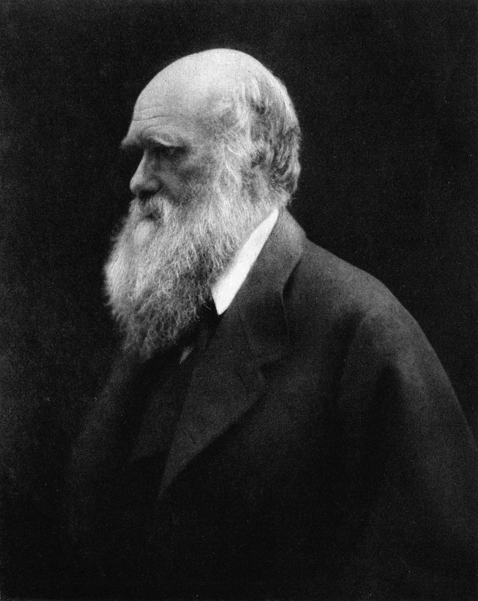

*** =right

---

<q>Nothing in biology makes sense, except in the light of evolution</q> (Dobzhansky 1973)

<q>Nothing in evolution makes sense, except in the light of population genetics</q> (Lynch 2007)

--- .segue .dark 

## Key concepts

---

## Your genome

- Size in base-pairs?
- Size in cm?
- Mass in picograms?
- Number autosomes?
- Number of sex chromosomes?
- Number of genes?
- % that is protein coding?
- % that is functional?

---

## Your genome

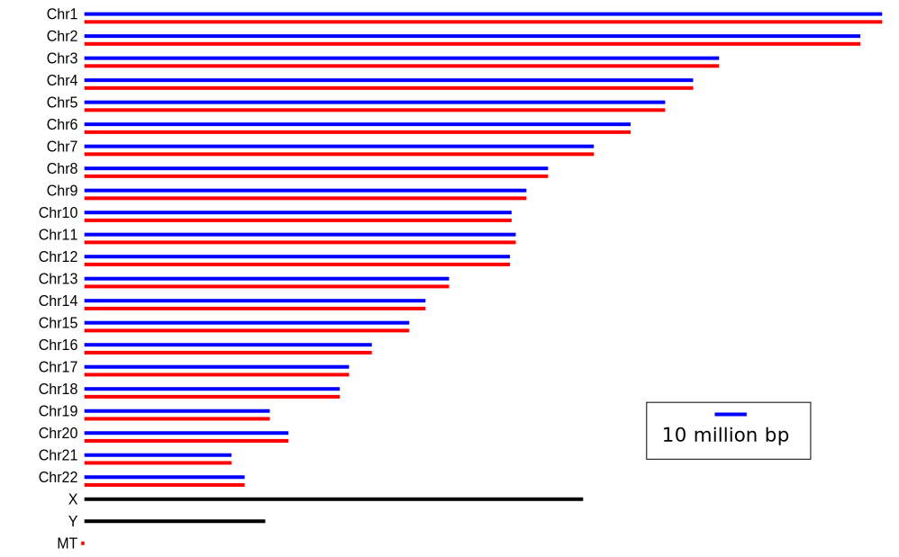

--- &twocol

## Genetic locus (plural loci)

*** =left

- Working definition: "a single position on a chromosome"
- Different variants at a locus are called **alleles**
- Difficult to determine in practise
- Simplistically a single nucleotide
- Extending beyond that depends on recombination
- Recombination results in independent evolutionary histories for unlinked loci

*** =right

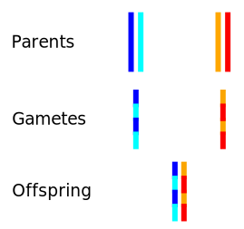

--- &twocol

## Examples

*** =left

- Single copy genes/exons (at least practically)
- SNPs
- Microsatellites
- Mitochondrial DNA is a single locus
- Y chromosome (more or less) a single locus

*** =right

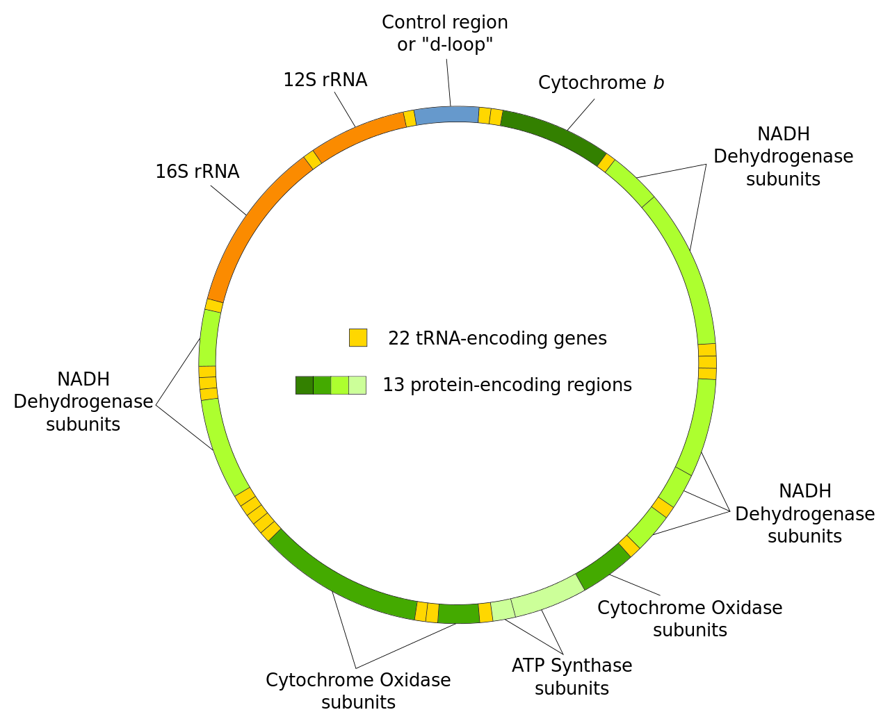

--- &thirds

## Neutral evolution

*** =left

- Often people think about evolution in terms of natural selection
- What if there is no selection?
- Motoo Kimura: Neutral theory of molecular evolution, 1968
- Loci evolve by genetic drift
- Drift is determined by the population (size and gene flow)
- Basis of population genetics and phylogenetics
- "Null hypothesis" of molecular evolution

*** =right

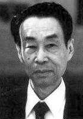

---

## Genetic drift

### Differential reproductive success between generations

---

## Simulator

<iframe src = 'https://www.whfreeman.com/BrainHoney/Resource/6716/SitebuilderUploads/Hillis2e/Student%20Resources/Animated%20Tutorials/pol2e_at_1502_genetic_drift_simulation/pol2e_at_1502_genetic_drift_simulation.html' height='600px'></iframe>

--- .segue .dark 

## Single locus phylogenetics - theory

---

## Molecular dating of sabretooth cats

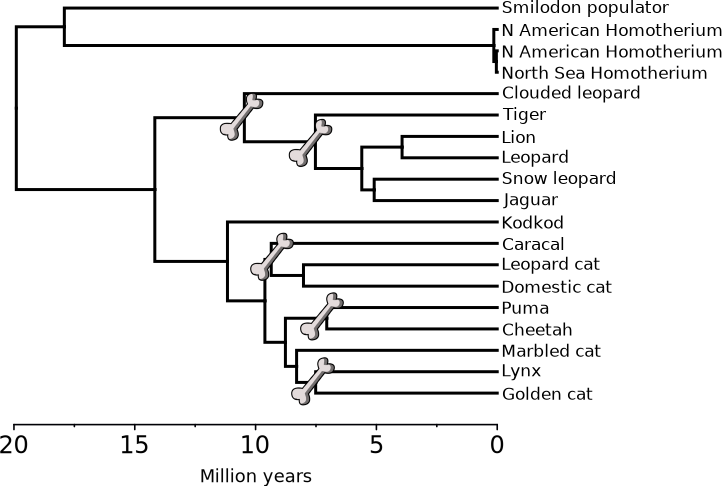

---

## Single locus tree (AKA gene tree)

- Evolutionary history of a genetic locus, represented as a tree
- (not always an actual gene)
- Can be used to infer species or population histories*
- Any recombining genome has multiple loci, each with its own gene tree
- Easy to calculate using genetic data (often sequences)

---

## Example: mitochondrial tree

---

## Gene tree terminology

--- &twocol

## Clades

*** =left

*** =right

- A clade contains one ancestor and all its descendents
- It is a monophyletic group
- Modern taxonomy (generally) tries to align with clades

---

## How does the tree form: lineage sorting

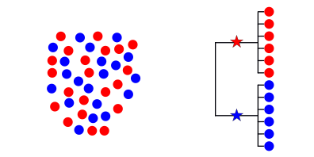

---

## How does the tree form: lineage sorting

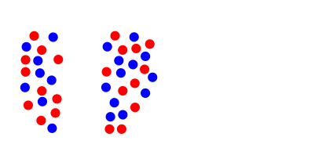

---

## How does the tree form: lineage sorting

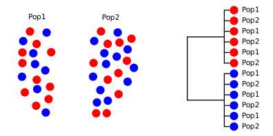

---

## How does the tree form: lineage sorting

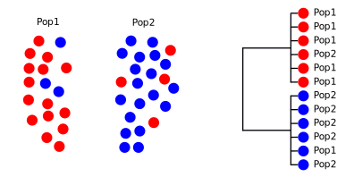

---

## How does the tree form: lineage sorting

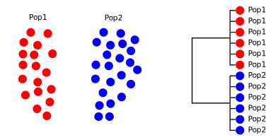

---

## Lineage sorting summary

- Drift sorts the lineages into clades
- This takes time, we can't detect the divergence immediately
- We go through stages of complete/incomplete monophyly
- incomplete to complete lineage sorting
- lineage sorting is faster when the population size is small (= more drift)
- Mutation builds upon the clades, monophyly is retained [unless there is gene flow]
- ILS can be a real problem for inferring relationships, especially in large populaitons with recent divergence events

--- .segue .dark 

## Single locus phylogenetics - methods

---

## PCR and Sanger sequencing

<embed src="./assets/img/BNS2002_prac_protocol.pdf" title="plot of chunk unnamed-chunk-17" width="100%" height="500" type="application/pdf" />

---

## Next generation sequencing

---

## NGS: ancient DNA

- Fragmented ancient DNA is challenging for PCR
- NGS allows whole DNA molecules to be sequenced
- High levels of contamination
- Hybridisation capture often used
- Especially for complete mitochondrial genome sequences

---

## NGS: metabarcoding

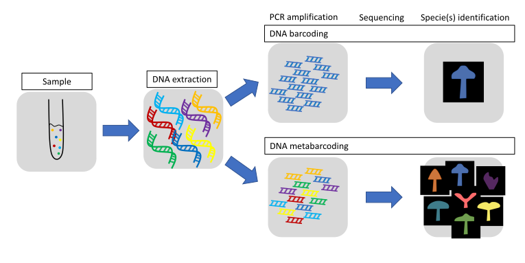

--- .segue .dark 

## Single locus phylogenetics - discoveries

--- &twocol

## Macrauchenia

*** =left

- Native South American mammal, in order Liptoterna
- Appeared 7 Ma
- Last species, *M. patachonica*, extinct ~10 Ka
- First collected 1834 in Argentina by Charles Darwin, on HMS Beagle. Identified as "some large animal, I fancy a Mastodon".
- Divergence time from extant mammals unknown

*** =right

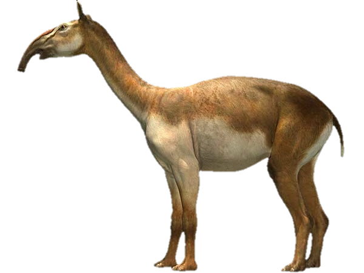

---

## Macrauchenia mitogenome phylogeny

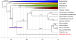

--- &twocol

## Giant beaver (*Castoroides*)

*** =left

- 2 m long, up to 125 kg, 15 cm incisors
- Extinct ~12 Ka, coinciding with arrivial of Clovis
- Several derived adapatations for wood cutting and aquatic life
- Information on evolution of "ecosystem engineers"?

*** =right

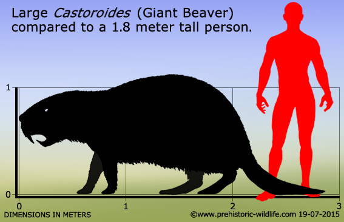

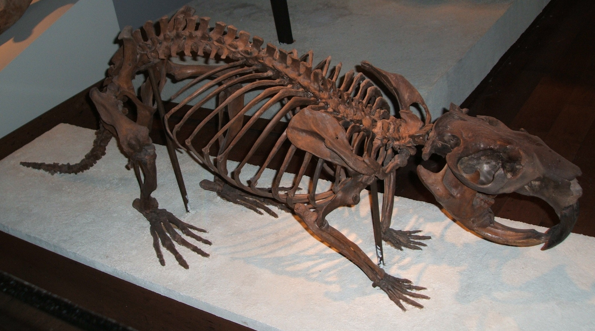

---

## Giant beaver mitogenome phylogeny

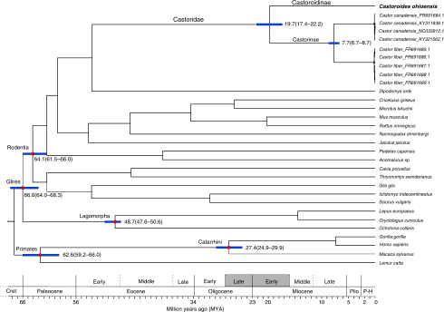

--- &twocol

## Mediterranean Dwarf elephants

*** =left

- Multiple Mediterranean islands
- 1.5 to 2.3 m at shoulder
- Direct ancestor is *Palaeoloxodon antiquus*
- Example of insular dwarfism
- Phylogeny could provide information on the dwarfing rate

*** =right

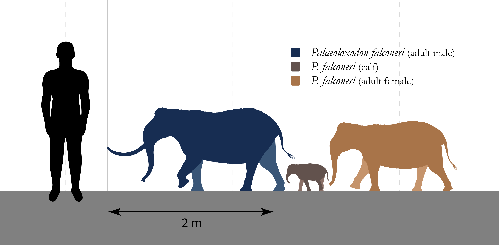

---

## Dwarfing rate

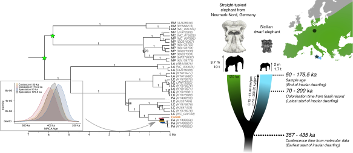

---

## Background reading

- Any phylogenetics chapters in the course text book, especially:
- **Avise (2004) Molecular markers, natural history, and evolution **
- **Page & Holmes (1998) Molecular evolution: a phylogenetic approach**
- Papers for case studies at end of lecture

---

<embed src="./assets/img/Westbury et al. - 2017 - A mitogenomic timetree for Darwin’s enigmatic South American mammal Macrauchenia patachonica.pdf" title="plot of chunk unnamed-chunk-29" width="100%" height="500" type="application/pdf" />

---

<embed src="./assets/img/Xenikoudakis et al. - 2020 - Ancient DNA reveals twenty million years of aquatic life in beavers.pdf" title="plot of chunk unnamed-chunk-30" width="100%" height="500" type="application/pdf" />

---

<embed src="./assets/img/Baleka et al. - 2021 - Estimating the dwarfing rate of an extinct Sicilian elephant.pdf" title="plot of chunk unnamed-chunk-31" width="100%" height="500" type="application/pdf" />

--- &thankyou

## Next time

**Multilocus phylogenetics**
